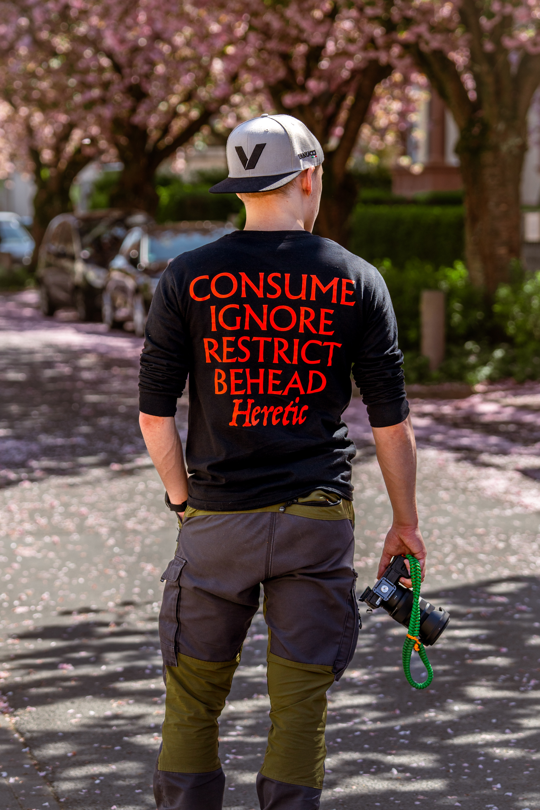

I am Moritz "Fenex" Friedewald, a Media Informatics student at THM Friedberg.

I focus on practical software development with strong interest in architecture, tooling, and problem-driven solutions. My core stack is C# and ASP.NET, and I also explore Go and Zig.

# How I Work
- Allways curious to read about new stuff
- Fast and independent onboarding into new topics
- Structured implementation with practical outcomes
- Balance between technical clarity and creative experimentation

# Areas I Enjoy

- Parser and compiler related projects
- Backend and support tooling
- Data-oriented systems and game development
- Creative production: music, 3D, visual design

# Goal

Build software and tools that are useful, maintainable, and enjoyable to work with.
